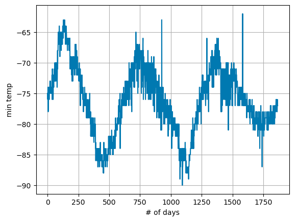

# WebScraping-challenge

## Description
Taking a look at Mars temperature and atmospheric pressure data.

## Table of Contents

- [Analysis](#questions)
- [Credits](#credits)
- [License](#license)
- [Contact](#contact)

## Questions
How many months exist on Mars?  
12 months on Mars.  

How many Martian days' worth of data are there?  
1867 days  

What are the coldest and the warmest months on Mars?  
The coldest month is the Third month.   
The warmest month is the Eight month.  

Which months have the lowest and the highest atmospheric pressure on Mars?  
Lowest pressure: The Sixth month  
Highest pressure: The Ninth month  

How many terrestrial days exist in a Martian year?  
Based on spacing between the peak there are about 675 days in a Martian year. 

## Credits
Geronimo Perez

## Contact
If there are any questions of concerns, I can be reached at:
##### [github: velvetklr](https://github.com/velvetklr)
##### [email: velvetklr@gmail.com](mailto:velvetklr@gmail.com)
